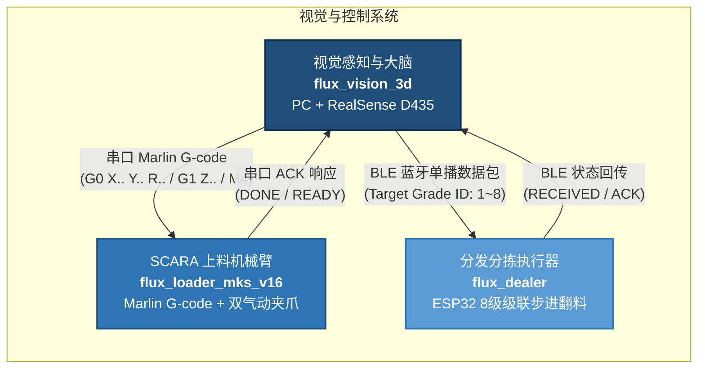
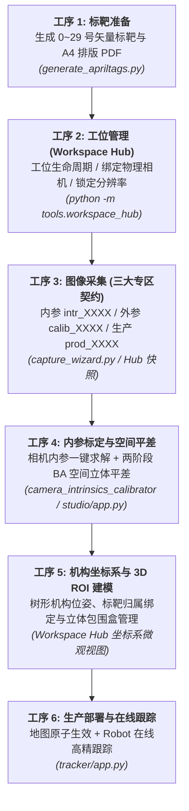
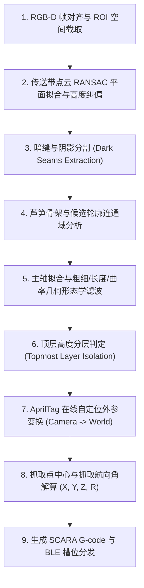

# flux_vision_3d — 芦笋 3D 视觉与智能抓取位姿估计系统

[](https://python.org)
[](https://opencv.org)
[](https://www.intelrealsense.com)
[]()
[]()

`flux_vision_3d` 是专为**流水线传送带上多层复杂堆叠、紧密并排贴合的细长果蔬（绿芦笋）**研发的工业级 3D 视觉感知、全场景空间标定与智能抓取位姿估计系统。

系统通过顶置 3D 深度相机（Intel RealSense D435）实时感知流水线物料分布，完成传送带纠偏、暗缝分割、高度分层与主轴拟合，解算最顶层芦笋的空间抓取位姿 $(X, Y, Z, R)$，生成标准 G-code 驱动下游 **SCARA 机械臂（flux_loader_mks_v16）** 实现高动态无碰撞分拣抓取，并通过 BLE 蓝牙低功耗通信向 **分发翻转机构（flux_dealer）** 写入多级品质分拣槽位。

同时，系统内置完整的**工业级全生命周期 AprilTag 空间建图标定工具链**，涵盖 **工位与数据管理中枢 (Workspace Hub)**、**空间建图工作站 (Spatial Mapping Studio)** 与 **Robot 在线跟踪**，提供“工位硬件绑定 $\rightarrow$ 内参/外参/生产三大图集隔离 $\rightarrow$ 两阶段 BA 空间平差 $\rightarrow$ 机构与 3D ROI 空间建模”的严格工业闭环。

---

## 目录

- [系统拓扑与业务流](#系统拓扑与业务流)
- [核心硬件与技术规格](#核心硬件与技术规格)
- [快速上手](#快速上手)
  - [环境准备](#环境准备)
  - [一键启动 Dashboard](#一键启动-dashboard)
  - [Dashboard 功能总览](#dashboard-功能总览)
- [AprilTag 空间标定全流程体系](#apriltag-空间标定全流程体系)
  - [标定工序流水线与工作台划分](#标定工序流水线与工作台划分)
  - [工位工作空间中枢 (Workspace Hub) 机制与动态页签区](#工位工作空间中枢-workspace-hub-机制与动态页签区)
  - [空间建图工作站 (Spatial Mapping Studio)](#空间建图工作站-spatial-mapping-studio)
- [视觉算法管线详解](#视觉算法管线详解)
- [项目结构与模块划分](#项目结构与模块划分)
- [自动化测试与质量保障](#自动化测试与质量保障)
- [技术文档导航](#技术文档导航)

---

## 系统拓扑与业务流



---

## 核心硬件与技术规格

| 维度 | 规格 / 指标 | 工程设计与技术要点 |
| :--- | :--- | :--- |
| **3D 深度传感器** | Intel RealSense D435 | 主动红外双目结构光 + 彩色全局快门，支持 1280×720 / 1920×1080 图像流 |
| **安装方式与倾角** | 黑色皮带正上方大倾角俯视 $(\pm 30°)$ | 算法内置传送带点云平面 RANSAC 自适应纠偏，消除倾角安装导致的深度梯度误差 |
| **推荐工作距离** | $550 \sim 700\text{ mm}$（基准 ~640mm） | 严格避开 D435 近距物理盲区（< 280mm），保证视野覆盖整个输送带截面 |
| **空间标靶系统** | AprilTag 16h5 阵列 (ID 0~29, 边长 50mm) | Tag 0 物理锁定机械臂 SCARA 笛卡尔原点，Tag 1~29 固联于刚性机架作为空间建图标尺 |
| **多源标定融合** | 在线自定位 + 历史缓存 + 降级兜底 | 优先使用 AprilTag 在线实时 PnP 外参；遮挡时平滑锁定历史外参；无标靶回退至 config.yaml 手工标定矩阵 |
| **标定管理机制** | 工位沙盒隔离 + 三大图集专区 | 独立管理工位工作空间（Workspace Hub），划分为相机内参 (`intrinsics`)、外参建图 (`calibration`) 与生产采样 (`production`) 独立专区；绑定物理相机与锁定分辨率，保证几何真理源 (SSOT) 唯一性 |
| **执行机构通信** | 4 轴 SCARA (Marlin 固件) | 串口指令流：`G0 X{x} Y{y} R{r}` (水平对位) $\rightarrow$ `G1 Z{z}` (无碰撞下探) $\rightarrow$ `M4` (气爪闭合) |
| **分发机构通信** | 8 级级联步进翻料器 (ESP32) | 低功耗蓝牙 (BLE) 单播广播，下发分拣等级槽位 `Target Grade: 1~8` |

---

## 快速上手

### 环境准备

系统推荐运行在 64 位 **Windows 10 / 11** 环境，需已安装 **Python 3.10+** 及 USB 3.0 控制器：

```powershell
# 1. 克隆或进入项目根目录
cd d:\Software\asp_flux\spatial_vision

# 2. 安装 Python 核心依赖项
pip install -r requirements.txt
```

### 一键启动 Dashboard

项目提供一键启动脚本，直接拉起「芦笋上料自动化」Dashboard 大屏：

```powershell
# PowerShell 环境
./run.ps1
# 或简写
./run

# Windows CMD 命令行
run.bat
```

也可以通过 Python 命令直接拉起：

```powershell
python tools/gui_launcher.py
```

### Dashboard 功能总览

Dashboard 以 12 张卡片分三组组织全部功能入口，每张卡片可用数字/字母快捷键直接拉起：

```text
===============================================================================
             芦笋上料自动化 - 工业视觉综合控制中心 (Dashboard)
===============================================================================
 [A 环境场景]
   [1] 工位中枢 (Workspace Hub)          [2] 确定输入输出设备
 [B Tag 标定流水线 (AprilTag)]
   [3] AprilTag 管理器    [4] 采图向导
   [5] 空间建图工作站 (Spatial Mapping Studio)
   [6] 芦笋抓取位姿离线验证 (文件照片输入/批量解算)
   [7] Robot 在线跟踪
 [D 生产调试]
   [8] RealSense 诊断    [9] SCARA 机械臂调试
   [T] 系统环境深度诊断与测试套件    [P] 安装/更新依赖    [X] CMD
===============================================================================
```

#### 相机查看器快捷键 (`d435_viewer.py`)

在 Dashboard `[8]` RealSense 诊断卡片启动的相机视窗中，提供丰富的交互快捷键：

| 按键 | 功能说明 |
| :---: | :--- |
| `Space` | **画面定格 / 继续取流**：暂停当前画面便于巡检细节 |
| `D` | **开启 / 关闭芦笋视觉分析**：实时显示传送带纠偏轮廓、抓取候选轴与顶层芦笋高亮 |
| `G` | **打印最顶层芦笋 G-code**：在终端打印当前最适抓取位姿的 SCARA 驱动代码与位姿数据 |
| `S` | **抓拍快照**：同步保存原色彩图、伪彩色深度热力图及点云数据至 `data/snapshots/` |
| `H` | **切换显示模式**：在矫正高度图 (Corrected Height) 与原生深度图 (Raw Depth) 之间切换 |
| `A` | **自适应拉伸深度色带**：自动以画面分位距自适应拉伸热力图，增强细微高度层级对比 |
| `[` / `]` | **手动调节深度色彩范围**：微调深度可视化的上下截断门限 |
| `Q` / `Esc` | **安全退出视窗** |

---

## AprilTag 空间标定全流程体系

针对工业现场环境振动、相机偶发位移与多工况多批次管理难点，系统打造了闭环的 **AprilTag 16h5 空间标定流水线**。

### 标定工序流水线与工作台划分

在 Dashboard 按 **`[1]`** 可直接拉起 **工位工作空间中枢 (Workspace Hub)**：

```text
标准流水线: [1 制靶] -> [2 工位中枢/硬件绑定] -> [3 采图向导] -> [4 内参标定 & 外参平差] -> [5 机构/3D ROI建模] -> [6 Robot跟踪]
快捷入口:   Dashboard [1] 随时呼出「工位工作空间中枢 (Workspace Hub)」管理多工位与三大图集
```



| 序号 / 键位 | 模块工具 | 核心功能与工程要点 |
| :---: | :--- | :--- |
| **顶级 `[G]`** | **芦笋上料自动化 (Dashboard)**<br>`gui_launcher.py` | **1280x1000 工业科技总控大屏**：常驻硬件探针、卡片网格、右侧动态即时说明大屏 (Live Inspector)，统一调度全系统生产、标定与测试任务 |
| **Dashboard `[1]`** | **工位工作空间中枢 (Workspace Hub)**<br>`tools/workspace_hub/` | **960x720 工业控制台（左右两栏 + 动态页签区）**：工位生命周期、硬件设备绑定、分辨率锁定、三大业务图集管理、坐标系树与 3D ROI 空间配置、数据自愈 Dashboard；执行 `python -m tools.workspace_hub` 即可启动 |
| **`[2]`** | **多视角交互采图向导**<br>`capture_wizard.py` | 专职采图工具：GUI 先行纯预览，点[开启]取流，按空格连拍保存，图像严格按照语义命名前缀（`intr_` / `calib_` / `prod_`）存入目标图集专区 |
| **`[S]`** | **空间建图工作站 (Spatial Mapping Studio)**<br>`tools/spatial_mapping_studio/` | **一站式空间立体建图与深度平差工作台**：样本审核画板、两阶段非线性 BA 平差、热力覆盖率与体检闭环 |
| **`[3]`** | **超精重提取引擎**<br>`tag_super_extractor.py` | 16 级阈值网格 + 自适应双尺度 CLAHE + 亚像素级角点精修，极限召回暗光/反光/弱对比度标靶 |
| **`[4]`** | **静默空间建图求解**<br>`tag_map_builder.py` | 纯计算命令行求解器：图论连通性建模 $\rightarrow$ 两阶段 BA（Cauchy 鲁棒核 + MAD 粗差清洗） |
| **`[5]`** | **Robot 在线跟踪**<br>`tools/tracker/app.py` | 真实相机实时解算目标 Tag 世界坐标 (世界系=机械臂坐标系)，机械臂"抬起→平移→下探"安全路径联动跟踪，到位后 M114 回读对比偏差用于相机位置校准 |
| **`[W]`** | **标靶 ID 白名单管理** | 联动 `tag_whitelist.yaml` 管理有效 Tag ID 列表，一键探索放行未知标靶或剔除异常 ID |
| **`[D]`** | **标靶漏检病因切片诊断**<br>`diagnose_tag_frame.py` | 深入分析真图候选四边形轮廓，深度诊断因反光、对比度过低、畸变造成的漏检原因 |

---

### 工位工作空间中枢 (Workspace Hub) 机制与动态页签区

工位工作空间中枢 (`tools/workspace_hub/`) 采用 960×720 精致深色工业科技风**左右两栏**设计，定位为**“工位管理与数据工作空间”**，是连接现场硬件配置、数据采集、离线解算与生产部署的核心中枢。

#### 1. 架构解耦与核心职责
- **工位即工作空间 (Workspace)**：自包含单一工位全部数据资产，包含相机内参标定专区 (`intrinsics/`)、外参建图专区 (`calibration/`)、生产采样专区 (`production/`)、元数据 `workspace_meta.yaml`、空间场景树 `spatial_scene.yaml`、白名单 `tag_whitelist.yaml` 与生产几何地图 `tags_map.yaml`；
- **全鼠标化与无快捷键**：所有交互均由精准鼠标点击驱动，界面无冗余按键说明，轻量纯净；
- **操作内嵌收敛与去“发布”化**：彻底移除左侧工位右键菜单，所有运维动作（重命名、打开文件夹、修改备注、更新元数据、克隆、删除、新建机构坐标系）全部收拢在 Dashboard 看板中；
- **单一真理源 (SSOT) 锁定**：工位强绑定物理相机类型 (`realsense` / `usb`) 与物理分辨率规格（如 `1920x1080`），杜绝采图/建图/生产跨工序分辨率失配；
- **数据一致性核验与自动自愈**：Dashboard 实时比对元数据记录与物理磁盘照片真值，提供 `[更新元数据]` 按钮一键纠偏，杜绝数据矛盾。

#### 2. 左右两栏布局与自适应动态页签区

| 区域 | 布局结构 | 说明 |
| :--- | :--- | :--- |
| **左栏 (0~340px)** | 树形导航（工位根节点 + 机构坐标系子节点）+ `+ 新建 Workspace` | 切换页签时**保持稳定不动**，支持展开/收起 |
| **右栏 (340~960px)** | 随树选中层级动态切换的专属页签内容区 | 顶部 Header 胶囊自适应切换 |

##### A. 工位宏观视图 (选中工位根节点时)
- **Tab 0: 大盘看板 (Dashboard)**：工位基础信息展示、运维操作条 (`[重命名]`, `[打开目录]`, `[克隆工位]`, `[删除]`, `[新建坐标系]`)、几何健康大屏、外参重投影 RMSE 与数据一致性一键自愈；
- **Tab 1: 相机&内参 (Camera & Intrinsics)**：
  - 展示硬件绑定信息与锁定物理分辨率；
  - 棋盘格/圆形标定板图集管理（采用 3×3 网格墙展示）；
  - 内置一键内参标定求解器 (`CameraIntrinsicsCalibrator`)，自动解算焦距、主点与畸变参数，写穿持久化至 `intrinsics/camera_intrinsics.yaml`；
- **Tab 2: 外参建图 (Extrinsic Mapping)**：
  - AprilTag 外参建图原始图集网格墙展示（单击选中、双击全宽放大）；
  - `[采图向导]` 快速呼出；
  - 直通空间建图工作站 (`Spatial Mapping Studio`) 进行两阶段 BA 空间平差；
- **Tab 3: 生产图集 ★ (Production Gallery)**：
  - 现场工件采样相册（只读/检视），承载实际生产运行中的物料帧。

##### B. 机构微观视图 (选中机构坐标系子节点时)
- **Tab 0: Tags 标靶与位姿**：
  - 机构位姿配置（基准坐标系相对位置与欧拉角变换）；
  - 标靶物理边长专属配置模态窗 (`MarkerSizeModal`)；
  - 10-Slot 标靶归属放行矩阵，精准配置当前机构绑定的标靶 ID 集合；
- **Tab 1: ROI 物件 (3D ROI Space)**：
  - 当前机构坐标系下的 3D 感兴趣区域立体包围盒管理；
  - 支持物料检测、抓取防撞、去噪屏蔽等多种几何物件的增删改查。

#### 3. 图像命名契约与数据规范 (Data Contract)

彻底终结历史双轨制与随意命名，系统建立严格的业务专属前缀与 4 位自增补零规范：

| 专区类型 | 物理存储目录 | 图像命名格式 | 业务职责 |
| :--- | :--- | :--- | :--- |
| **相机内参图集** | `intrinsics/raw_images/` | `intr_XXXX.png` | 棋盘格 / 圆点标定板原始高精照片 |
| **外参建图图集** | `calibration/raw_images/` | `calib_XXXX.png` | AprilTag 空间建图与多视角平差照片 |
| **生产采样图集** | `production/raw_images/` | `prod_XXXX.png` | 现场流水线工件与日常生产采集图像 |

> **跨平台安全读写**：系统全量采用 `src/utils/image_io.py` 提供的 `imread_unicode` 与 `imwrite_unicode`，基于内存字节流中转，彻底解决 Windows 平台下中文路径导致 OpenCV 崩溃的隐患。

#### 4. 极致性能优化与零卡顿渲染

- **帧级命中区碰撞缓存 (Hit-box Cache)**：实现 `_get_interactive_hover_key()`，鼠标在卡片/按钮外侧或同一按钮内移动时跳过重绘直接返回缓存画布，Hover 响应时间从 ~13s 骤降至 **0.004 ms (248,000 FPS)**，彻底消除鼠标移动卡死；
- **元数据惰性反序列化缓存**：优化 `Workspace.load()`，默认优先信赖 `workspace_meta.yaml` 中持久化的状态字段，杜绝每帧重复解析磁盘文件，场景加载时间从 8.2s 优化至 **41ms (提升 200 倍)**；
- **微切片 Patch 局部贴图**：非 ASCII 中文文本绘制采用基于 Bounding Box 的轻量微切片贴图，消除整屏内存复制。

---

### 空间建图工作站 (Spatial Mapping Studio)

空间建图工作站 (`tools.spatial_mapping_studio`) 整合了样本数据清洗、拓扑网络验证与两阶段 BA 空间平差：

1. **样本画板交互审核**：自由选择样本帧，右键快捷剔除离群样本或整帧旁路；
2. **两阶段非线性平差 (Two-Stage BA)**：
   - 第一阶段：基于单应性矩阵与 IPPE 算法构建初始相机外参和标靶 3D 初值；
   - 第二阶段：引入 **Cauchy 鲁棒核函数** 与 **中位数绝对偏差 (MAD)** 迭代清洗粗差，联合优化全量位姿与三维路标点；
   - 尺度与世界系锚定：基于双标靶实际物理间距尺度对齐，并将 Tag 0 平移对齐至 SCARA 机械臂坐标系原点；
3. **空间覆盖率看板**：直观展示视场四周及四角的标靶检测覆盖密度，杜绝视野边角盲区。

---

## 视觉算法管线详解

针对传送带上多层交错堆叠的绿芦笋，视觉处理核心引擎 (`src/vision/asparagus_analyzer.py`) 运行 9 步高抗噪感知管线：



1. **传送带纠偏**：通过 RANSAC 鲁棒拟合黑色皮带主平面，构建旋转矩阵将点云矫正为以传送带平面为 $Z=0$ 的正交空间，消除倾角安装带来的系统误差；
2. **暗缝分割**：芦笋并排贴合处存在微小缝隙阴影，算法结合自适应阈值与形态学开闭运算精准切开粘连边界；
3. **顶层芦笋识别**：在矫正后的高度图中，统计各候选芦笋区域的上分位高程值，高置信度锁定绝对位于最上层、无其他物料压覆的单根芦笋；
4. **抓取安全兜底**：若检测到标定外参异常或高度不在安全抓取区间（$Z \notin [5, 45]\text{ mm}$），系统立即熔断拦截，严禁输出下探 G-code，防止夹爪撞击皮带。

---

## 项目结构与模块划分

```text
spatial_vision/
├── config.yaml                    # 核心全局配置 (相机默认规格、视觉门限、白名单、串口参数)
├── README.md                      # 项目总览与核心使用指南
├── requirements.txt               # Python 依赖清单
├── run.bat / run.ps1              # 一键交互式控制终端启动入口
│
├── config/                        # ⚙️ 生产配置文件沙盒
│   └── tags_map.yaml              #    生产在线 AprilTag 空间地图 (唯一生产基准)
│
├── docs/                          # 📚 深度工程与设计文档库
│   ├── CHANGELOG.md               #    版本更新日志与重大演进历程记录
│   ├── architecture.md            #    系统分层架构设计与数据流转说明
│   ├── algorithm_pipeline.md      #    芦笋 3D 视觉处理管线逐层剖析
│   ├── requirements.md            #    产品需求规格与工程指标基线
│   ├── apriltag_calibration.md    #    AprilTag 建图、两阶段 BA 平差与在线定位方案
│   └── workspace_hub_guide.md     # 工位管理中枢 (Workspace Hub) 技术操作指南
│
├── src/                           # 🧠 核心架构与领域驱动源码
│   ├── workspace/                 #    工位领域驱动核心包 (DDD 架构)
│   │   ├── workspace_entity.py    #      Workspace 实体 (数据契约/路径解析/分辨率与相机规格)
│   │   ├── workspace_manager.py   #      工位工作空间管理器 (生命周期/增删改查/沙盒隔离)
│   │   ├── tag_whitelist_manager.py #    Tag 白名单与标靶物理规格持久化管理
│   │   ├── coordinate_manager.py  #      多机构坐标系树管理器 (FrameTree)
│   │   ├── roi_manager.py         #      3D 空间 ROI 感兴趣区域物件管理
│   │   └── health_auditor.py      #      工位几何健康度与元数据一致性自愈审计器
│   │
│   ├── calibration/               #    标定与空间平差核心引擎
│   │   ├── solvers/               #      高精数值求解器与数学内核
│   │   │   ├── camera_intrinsics_calibrator.py # 相机内参标定求解器 (棋盘格角点/重投影误差)
│   │   │   ├── ba_optimizer.py    #      两阶段 BA 平差优化器 (Cauchy核 + 尺度基线对齐)
│   │   │   ├── covisibility_graph.py #   多视角标靶共视网络图论建模与割点分析
│   │   │   ├── frame_extrinsic_solver.py # 机构坐标系外参求解器
│   │   │   ├── multiframe_milestone_solver.py # 多帧里程碑融合解算器
│   │   │   └── world_datum_aligner.py #  世界基准对齐 (Umeyama 相似变换与先验调平)
│   │   ├── manifest_repository.py #      标定清单与观测数据持久化仓储
│   │   ├── pnp_solver.py          #      标靶 PnP 空间位姿与二义性消歧求解器
│   │   ├── verification_reporter.py #    Per-Tag/Per-Frame 稳健统计与体检报告器
│   │   └── verification_visualizer.py #  3D 双四棱柱位姿对比与 2D 残差矢量渲染管线
│   │
│   ├── devices/                   #    硬件外设接入层
│   │   ├── camera_service.py      #      统一相机服务 (RealSense / USB 双物理后端)
│   │   └── camera_streamer.py     #      跨设备高帧率相机取流与连拍适配器
│   │
│   ├── vision/                    #    实时视觉感知与抓取引擎
│   │   ├── asparagus_analyzer.py  #      核心感知算法 (纠偏→暗缝分割→主轴提取→顶层解算)
│   │   └── tag_localizer.py       #      AprilTag 在线外参自定位器与安全降级熔断
│   │
│   └── utils/                     #    通用工业 UI 与基础构件
│       ├── image_io.py            #      Unicode 安全图像编解码 (imread_unicode / imwrite_unicode)
│       ├── viewport_manager.py    #      自适应高 DPI 视口与局部 Patch 贴图
│       ├── window_helper.py       #      Windows 原生窗口置顶、置前与无感激活辅助
│       └── config_guard.py        #      原子配置读写保护与备份保障
│
├── tools/                         # 🔧 运维与顶级应用程序
│   ├── gui_launcher.py            #    ★【顶级控制中心】芦笋上料自动化大屏 (Dashboard 首选入口)
│   ├── diagnose_env.py            #    系统环境深度诊断脚本 (Dashboard [T] 卡片承载)
│   ├── workspace_hub/             #    ★【工位中枢自包含包】(通过 python -m tools.workspace_hub 直接启动)
│   │   ├── __main__.py            #      模块直接执行入口
│   │   ├── app.py                 #      WorkspaceHubApp 核心驱动逻辑
│   │   ├── hub_state.py           #      工位状态机与数据沙盒模型
│   │   ├── hub_renderer.py        #      960x720 两栏自适应科技看板渲染引擎
│   │   ├── hub_hit_tester.py      #      鼠标命中判定与事件分发器
│   │   ├── pages/                 #      分页渲染器 (Dashboard / Gallery / Frames & ROIs)
│   │   └── states/                #      子状态机 (GalleryState, WhitelistState, GeometryState)
│   ├── spatial_mapping_studio/    #    ★【空间建图工作站·自包含包】(工序4 / python -m tools.spatial_mapping_studio)
│   │   ├── __main__.py            #      模块直接执行入口
│   │   ├── app.py                 #      SpatialMappingStudioApp 入口: 交互审核 + 两阶段 BA 平差 + 体检闭环
│   │   ├── mapping_ba_runner.py   #      异步两阶段 BA 平差调度器
│   │   ├── mapping_renderer.py    #      工作站看板渲染引擎
│   │   └── mapping_state.py       #      交互状态与数据沙盒模型
│   ├── tracker/                   #    ★【Robot 在线跟踪·自包含包】(工序6)
│   │   ├── app.py                 #      RobotOnlineTracker 入口: Tag 世界坐标解算 + 机械臂联动
│   │   ├── camera_controller.py   #      相机硬件控制器 (RealSense/USB 取流启停)
│   │   └── renderer.py            #      工具栏/叠加层/信息面板渲染器
│   ├── d435_viewer.py             #    RealSense D435 实时相机视窗与交互探针
│   ├── asparagus_offline.py       #    芦笋抓取位姿离线验证 GUI (照片输入/批量解算/G-code)
│   │
│   ├── capture/                   # 📷 多视角采图向导 (纯预览+保存, 严格语义命名前缀)
│   │   ├── capture_wizard.py      #    【工序3】交互采图向导 (GUI先行/空格连拍/曝光调节)
│   │   └── renderer.py            #    向导工具栏/画布/Toast 渲染器
│   │
│   └── calibration/               # 🎯 标定流水线小工具链
│       ├── generate_apriltags.py  #    【工序1】标靶矢量生成与 A4 排版 PDF
│       ├── tag_super_extractor.py #    离线超精重提取引擎 (16级网格+CLAHE)
│       ├── tag_map_builder.py     #    空间立体建图与两阶段 BA 平差命令行求解
│       ├── tag_manifest_reviewer.py #  采图清单质检画板: 交互式保留/剔除审核
│       ├── tag_manager.py         #    标靶管理 (联动标靶图纸生成)
│       └── diagnose_tag_frame.py  #    单帧漏检病因切片深度诊断
│
├── tests/                         # ✅ 自动化单元测试与回归套件 (298 项测试全绿通过)
│   ├── test_workspace_hub.py      #    工位驾驶舱与交互全覆盖测试
│   ├── test_workspace_entity.py   #    工位数据模型、物理路径与单源分辨率测试
│   ├── test_workspace_manager.py  #    工位生命周期与数据沙盒隔离测试
│   ├── test_tag_whitelist_manager.py # Tag 白名单与单源标准测试
│   ├── test_camera_intrinsics_calibrator.py # 相机内参标定求解器数学测试
│   ├── test_capture_wizard.py     #    采图向导与命名契约测试
│   ├── test_spatial_mapping_studio.py # 空间建图工作站交互与调度测试
│   ├── test_real_snapshot.py      #    真实工业快照全量测试 (20 组真实工业快照 100% 通过)
│   ├── test_ba_optimizer.py       #    两阶段 BA 平差数学单元测试
│   ├── test_covisibility_graph.py #    共视拓扑图论连通性单元测试
│   ├── test_world_datum_aligner.py#    世界系锚定对齐与形变冲突检测测试
│   └── ...                        #    涵盖设备抽象、UI 组件、几何解算等 298 项全量用例
│
└── data/                          # 📁 数据存储沙盒
    ├── snapshots/                 #    日常运行快照库 (RGB + 深度热力图 + 点云)
    ├── workspaces/                #    工位工作空间总库 (物理沙盒隔离，三大业务专区)
    │   └── <workspace_id>/        #    具体工位工作空间
    │       ├── workspace_meta.yaml      # 工位自描述元数据 (绑定相机/锁定分辨率/统计指标)
    │       ├── tags_map.yaml            # 生产在线 AprilTag 空间几何地图 (唯一基准)
    │       ├── tag_whitelist.yaml       # 统一标靶白名单与标靶边长配置
    │       ├── spatial_scene.yaml       # 统一空间几何场景与 3D ROI 空间配置
    │       ├── intrinsics/              # 【专区一】相机内参标定业务专区
    │       │   ├── raw_images/          #   棋盘格标定原图 (intr_0001.png, ...)
    │       │   ├── camera_intrinsics.yaml # 工位专属高精相机内参 (单一真理源)
    │       │   └── reports/             #   内参标定残差评估报告
    │       ├── calibration/             # 【专区二】外参建图与立体平差业务专区
    │       │   ├── raw_images/          #   AprilTag 外参原图 (calib_0001.png, ...)
    │       │   ├── tag_observations.yaml# 离线标定观测清单
    │       │   ├── tags_map_raw.yaml    # 阶段一自由平差底图
    │       │   ├── reports/             #   BA 平差盲测质检报告
    │       │   └── visualized/          #   残差矢量与几何特征标注图
    │       └── production/              # 【专区三】现场生产采样专区
    │           ├── raw_images/          #   生产现场物料采图 (prod_0001.png, ...)
    │           └── reports/             #   生产执行质检单
    └── apriltags_16h5/            #    生成的 AprilTag 矢量图与打印 PDF
```

---

## 自动化测试与质量保障

系统建立了从纯几何数学单元测试、领域模型测试，到真实工业快照回归的全方位 CI 质量保障体系：

```powershell
# 运行全部自动化测试 (通过 CLI 终端)
./run -> 选择 [T] -> 选择 [A] 一键全量测试

# 或在命令行直接执行全量测试套件
python -m unittest discover tests
```

### 质量实测指标

- **单元测试自动化覆盖率**：**298 项全量单元测试 100% 通过**，覆盖领域模型、数值求解、UI 状态机与物理设备驱动；
- **真实工业快照锁定率**：基于现场采集的 **20 组复杂堆叠快照**，顶层芦笋检测与抓取点锁定成功率达到 **100.0%**（累计 136 根次）；
- **空间平差重投影精度**：实采图全局重投影均方根误差 (RMSE) 从初始 52.28px 经两阶段 BA 平差后稳定压降至 **< 0.8px**（标准靶场景优于 **0.035px**）；
- **渲染响应度**：Workspace Hub 经过 Patch 局部文本绘制与命中缓存优化后，Hover 响应延迟压降至 **0.004 ms**，达到无感丝滑交互。

---

## 技术文档导航

| 文档名称 | 核心内容概述 | 适用对象 |
| :--- | :--- | :--- |
| **[CHANGELOG.md](docs/CHANGELOG.md)** | 系统版本演进历程、架构重构纪录与实测战报 | 全员、架构评审、交付验收 |
| **[workspace_hub_guide.md](docs/workspace_hub_guide.md)** | 工位管理中枢 (Workspace Hub) 深度架构与 SOP 规范 | 现场实施、算法工程师、操作员 |
| **[architecture.md](docs/architecture.md)** | 系统整体分层架构、核心领域模型职责与数据总线设计 | 新成员快速上手、架构设计 |
| **[algorithm_pipeline.md](docs/algorithm_pipeline.md)** | 芦笋 3D 视觉处理管线九大环节数学推导与参数精析 | 算法开发、调优工程师 |
| **[apriltag_calibration.md](docs/apriltag_calibration.md)** | AprilTag 多标靶建图、两阶段 BA 平差与在线定位方案 | 标定研发、现场部署人员 |
| **[requirements.md](docs/requirements.md)** | 工业系统功能需求规格 (FR-1 ~ FR-12) | 需求评审、项目管理 |

---

*文档版本: 2026年10月 | flux_vision_3d 团队*
