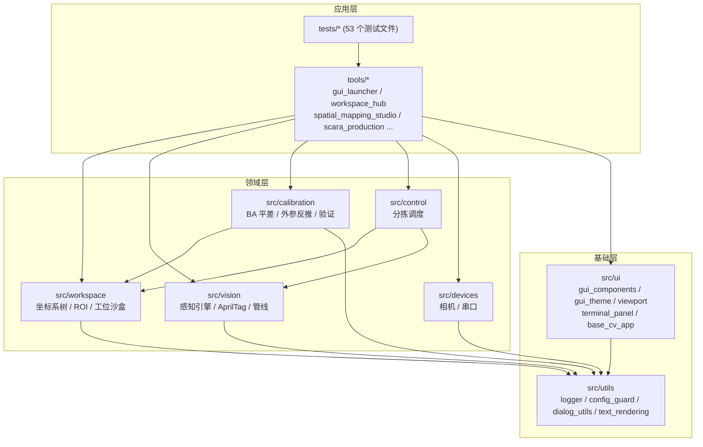
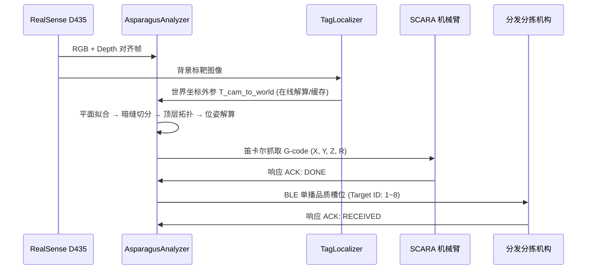

# 系统架构与模块职责

> **文档定位**：描述 `spatial_vision` 的分层架构、模块划分与空间数据流关系。
> **适用读者**：新成员入门、架构评审、代码走查。
> **更新说明**：2026-10-07 依据全仓库架构审查重写；`src/utils/text_rendering` 已完成下沉解耦；其余标注“待整改”的事项以审查报告为准。

---

## 1. 分层依赖架构

系统为**模块化分层解耦**的单向 DAG 依赖（无循环依赖，utils 为最底层）：



> **整改说明（已解耦）**：原 `src/ui/text_rendering` 已彻底下沉至 `src/utils/text_rendering.py`，算法层（`src/vision` 及 `src/calibration/verification`）与 UI 层（`src/ui`）的逆向依赖已消除，完全符合“算法层禁止依赖 UI 层”硬约束。

---

## 2. src 子系统与核心模块职责

### 2.1 workspace — 工位与空间场景中枢 (SSOT)

| 模块 | 职责 |
| :--- | :--- |
| `coordinate_manager.py` | **坐标树管理器**：`world` 根 + `fixed_transform`（平移+RPY）/ `tag_bound`（动标绑定）子帧；`get_transform`/`transform_points` 完成任意两帧级联变换；持久化至 `spatial_scene.yaml`（frames 节） |
| `roi_manager.py` | ROI 定义与挂载（挂载于坐标树子帧，存于 `spatial_scene.yaml` rois 节） |
| `workspace_manager.py` | 工位生命周期 CRUD、沙盒隔离、当前工位状态机 |
| `tag_whitelist_manager.py` | `tag_whitelist.yaml` 唯一真理源读写（Tag 局部名义坐标） |
| `health_auditor.py` | 数据一致性审计与自愈（含 tags_map 非法标靶清除） |

> **待整改**：`spatial_scene.yaml` 目前由 coordinate_manager 与 roi_manager 双写（各自“保留对方节点”），应收敛为单一 SceneStore；`health_auditor` 构成 tags_map 第二写者。

### 2.2 calibration — 标定与空间平差引擎

求解链分层递进（依赖方向自上而下）：

```text
covisibility_graph (共视图拓扑守门, 零外部依赖)
  → ba_optimizer (两阶段 BA: Cauchy 鲁棒核 + MAD 粗差清洗 + 尺度基线 Gauge)
  → world_datum_aligner (世界基准对齐 / Umeyama 相似变换)
  → multiframe_milestone_solver (多帧编排层)
frame_extrinsic_solver (子坐标系外参反推: 多靶配准 / 双靶定轴 / 单靶偏移)
```

- `manifest_repository.py`：观测清单仓储；
- `verification/`：`ba_report`（数据导出）、`verification_reporter`（稳健统计体检）、`verification_visualizer` / `prism_renderer`（可视化）。

### 2.3 vision — 实时视觉感知引擎

| 模块 | 职责 |
| :--- | :--- |
| `asparagus_analyzer.py` | 芦笋感知与抓取位姿解算（见 2.9 感知数据流） |
| `tag_localizer.py` | AprilTag 在线单帧外参定位与守门降级 |
| `tag_detector.py` / `pnp_solver.py` | 标靶检测与 PnP 位姿求解 |
| `pipelines/` | 14 条 2D 图像处理管线（h/f/b/c 系，管线注册表 `registry.py` 调度） |

### 2.4 control — 生产调度

- `sorting_dispatcher.py`：按 ROI（`role: source/...`）驱动物料分拣决策；
- `isolate_wheels_controller.py`：隔离轮工位控制。

### 2.5 devices — 硬件外设接入层

- `camera_service.py`：统一相机服务（RealSense / USB 双后端）；
- `robot_serial.py`：SCARA 串口 Marlin G-code 通信。

### 2.6 ui — GUI 组件层

`gui_components`（TabBar 等）、`gui_theme`（单源调色板）、`gui_window_manager`（窗口/视口/缩放）、`viewport_manager`（高 DPI 视口）、`terminal_panel`（内嵌终端）、`base_cv_app`（OpenCV 窗口基座）。

### 2.7 utils — 通用基础构件

`logger`（`get_logger(__name__)`）、`config_guard`（原子配置读写）、`dialog_utils`（跨平台原生对话框）、`text_rendering`（全仓统一高质量矢量中英文字体贴图渲染）。

---

## 3. 坐标系树与空间数据流（核心）

### 3.1 坐标树模型

- `world` 为唯一根节点（与 `tags_map.yaml` 和标靶锚点对齐）；
- 子坐标系为 `fixed_transform`（6-DOF 外参）或 `tag_bound`（绑定 Tag + 局部偏移）；
- **示例（皮带机坐标系）**：原点 = Tag 11 中心（名义局部 `[0,0,0]`），方向由 Tag 11 → Tag 14 连线约束（Tag 14 名义 `[-34, 490, 0]`），名义坐标唯一真理源在 `tag_whitelist.yaml`；
- 标定结果以 `{translation_xyz_mm, rotation_rpy_deg}`（xyz 外旋、度）存于 `spatial_scene.yaml` 的 `transform.calibrated` 节，即 `T_world_from_frame`；
- 运行时由 `CoordinateTreeManager.get_transform` 级联求解任意两帧变换，ROI 与目标位姿据此在皮带机系 ↔ 世界系 ↔ 机械臂系间换算。

### 3.2 标定到抓取的完整数据流

```mermaid
flowchart LR
    A["采图向导<br>tools/capture"] --> B["BA 平差<br>calibration/solvers/ba_optimizer"]
    B --> C["tags_map.yaml<br>(T_world_from_tag)"]
    C --> D["外参反推<br>frame_extrinsic_solver"]
    D --> E["spatial_scene.yaml<br>frames 节 (坐标树)"]
    E --> F["spatial_scene.yaml<br>rois 节 (挂载于子帧)"]
    F --> G["sorting_dispatcher<br>control"]
    G --> H["ScaraMotionPlanner"]
    H --> I["robot_serial<br>Marlin G-code"]
```



链条单向：采集 → 平差 → 地图 → 外参反推 → 坐标树 → ROI → 调度 → 执行，无回流。

### 3.3 配置文件写者矩阵

| 文件 | 唯一写者 | 备注 |
| :--- | :--- | :--- |
| `data/workspaces/<id>/tags_map.yaml` | `ManifestRepository.save_map` | health_auditor 自愈写回为待整改的第二写者 |
| `data/workspaces/<id>/spatial_scene.yaml` | **双写者（待整改）** | coordinate_manager（保留 rois 节）与 roi_manager（保留 frames 节）并存，应收敛为单一 SceneStore |
| `data/workspaces/<id>/tag_whitelist.yaml` | `tag_whitelist_manager.save_workspace_tag_config` | workspace_manager 存在旁路写入口，待整改 |
| `config/config.yaml` | `config_guard` 原子读写 | `calibration.anchor_tags` 段属违规残留双源，待清理 |

---

## 4. SCARA 机械臂坐标系硬约束

| 约束 | 取值 / 说明 |
| :--- | :--- |
| **机械零位绝对坐标** | `(X0, Y600, Z80, R90°)` (毫米+度)，与 SCARA 物理装配刚性绑定 |
| **Marlin 轴映射** | SCARA R 轴 (旋转) 在 Marlin 固件中映射至 E 轴；G92 命令需写 `G92 X0.00 Y600.00 Z80.00 E90.00`，禁用 `G92 X0 Y0 Z0` |
| **零点设置流程** | M84 (释放电机) → G92 (设零) → M114 (回读确认) 三步串行 |

---

## 5. 感知抓取数据流



### 5.1 感知引擎 — `src/vision/asparagus_analyzer.py`

| 职责 | 说明 |
| :--- | :--- |
| 传送带平面自标定 | 最小二乘拟合台面方程，反求相机安装倾角 |
| 3D 高程浮凸初筛 | 以台面为 $Z=0$ 基准，滤除背景杂质 |
| 黑帽暗缝实例切分 | 形态学 Black-Hat 结合横向结构元切开并排贴合物料 |
| 主轴拟合与偏航角解算 | `cv2.fitLine` 求解中心轴线方向，映射夹爪角度 $R$ |
| 顶层拓扑排序 | 按相对凸起净高锁定最顶层目标 (`is_topmost`) |
| 抓取安全兜底 | 外参异常或高度越界（$Z \notin [5, 45]\text{ mm}$）时熔断拦截，严禁输出下探 G-code |

**调用接口**：`analyze(color_bgr, depth_mm) -> List[AsparagusTarget]`

### 5.2 标靶定位器 — `src/vision/tag_localizer.py`

| 职责 | 说明 |
| :--- | :--- |
| 标靶检测 | AprilTag 16h5（CONTOUR 轮廓精修角点） |
| 地图查询 | 匹配工位 `tags_map.yaml` 中的 3D 空间坐标 |
| 静止标靶守门 | 至少 2 枚静止标靶才参与解算；动态/边缘标靶强制排除 |
| PnP 解算 | `cv2.solvePnPRansac()` (SQPNP + ITERATIVE 降级) |

---

## 6. 工具链矩阵 (现行)

| 工具 | 路径 | 定位 |
| :--- | :--- | :--- |
| **Dashboard 总控** | `tools/gui_launcher.py` | 顶级控制中心，统一注册与调度全部应用 |
| **工位中枢** | `tools/workspace_hub/` | 工位沙盒管理、白名单矩阵、一致性自愈（`python -m tools.workspace_hub`） |
| **空间建图工作站** | `tools/spatial_mapping_studio/` | 样本审核 + 两阶段 BA 平差 + 体检闭环（现行主力建图链） |
| **采图向导** | `tools/capture/capture_wizard.py` | 多视角交互采图 |
| **Robot 在线跟踪** | `tools/tracker/` | 实时 Tag 世界坐标解算 + 机械臂联动 |
| **SCARA 生产工作台** | `tools/scara_production/` | ROI 驱动分拣抓取（感知闭环待接入，当前为模拟队列） |
| **位姿工作室** | `tools/asparagus_pose_studio/` | 抓取位姿离线验证 |
| **隔离轮生产** | `tools/isolate_wheels_production/` | 隔离轮工位生产 |

> **待整改**：`tools/calibration/`（tag_map_builder、tag_manifest_reviewer、tag_manager、diagnose_tag_frame 等 ~150KB 旧 CLI 建图链）已被 spatial_mapping_studio 全面取代且未在 gui_launcher 注册，按 AGENTS.md 准则待物理删除。

---

## 7. 测试验证体系

`tests/` 共 53 个测试文件（unittest 风格，平铺）：

```powershell
python -m unittest discover -s tests -v      # 全量
python -m unittest tests.test_ba_optimizer   # 单模块
```

| 分组 | 覆盖情况 |
| :--- | :--- |
| calibration/solvers | **全覆盖**（ba_optimizer / frame_extrinsic / multiframe / world_datum / covisibility 均有专测） |
| workspace / control | 覆盖较全（manager / coordinate+roi / health_auditor / dispatcher / planner） |
| vision | pnp_solver、tag_detector、tag_localizer、asparagus_analyzer 有测；**14 条 pipelines 无逐一测试** |
| devices | **零覆盖**（camera_service、robot_serial 直接驱动产线硬件，待补契约测试） |

---

## 8. 配置文件规格

### 8.1 工位沙盒 (SSOT) — `data/workspaces/<workspace_id>/`

| 文件 | 内容 |
| :--- | :--- |
| `spatial_scene.yaml` | 坐标树（frames：类型/状态/prior/calibrated/calibration_spec）+ ROI（rois：frame_id/category/role/geometry） |
| `tags_map.yaml` | BA 输出的世界系标靶位姿 `T_world_from_tag` |
| `tag_whitelist.yaml` | 标靶白名单与局部名义坐标（Tag 编号分段：world 占 0–9，第 k 个子系占 k*10 ~ k*10+9） |
| `raw_images/` | 采图样本 |

### 8.2 全局 `config/config.yaml`

仅保留硬件、串口、视觉门限等非空间标定类参数；`calibration.anchor_tags` 全局锚点段属待清理的违规残留。

---

*关联文档：`docs/architecture.md`*
*文档版本: 2026-10-07 重写升级 | spatial_vision*
